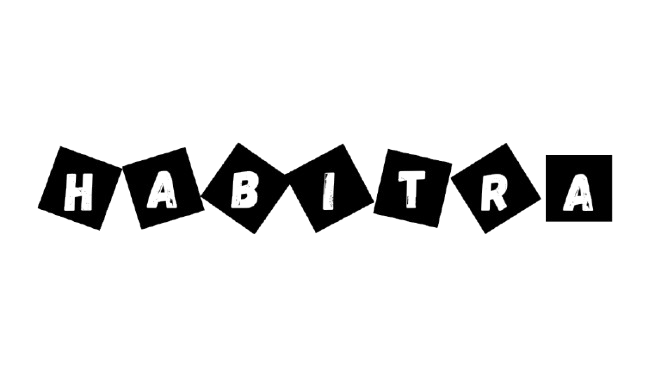

# About❓
This project aims to make a Habit Tracker to help accomplish goals, keep tabs on all of your good habits, and help getting rid of bad habits, all of this while making it fun, resembling a videogame.

# Objectives🎯
### Track both good and bad habits.
### Give an incentive to keep doing good habits.
### Discourage bad habits.
### Give you full control on what you want to achieve, or leave behind.

# Workshops💡📖
### [Workshop 1🤔](https://github.com/Fabiancipher/OOP_project/tree/main/Workshop-1)
In this workshop, we discuss the first parts of development, by analyzing requirements, user histories, mockups and identyfing classes via CRC Cards
### [Workshop 20️⃣1️⃣](https://github.com/Fabiancipher/OOP_project/tree/main/Workshop_2)
In this workshop, we discuss the conceptual design of the app, with classes and sequence diagrams, implementation of concepts and code placeholders
### [Workshop 3💪](https://github.com/Fabiancipher/OOP_project/tree/main/Workshop_3)
In this workshop, SOLID was implemented, and we discuss how it affected our design choices coming forward and retroactively.

### [Workshop 4🖥️✨](https://github.com/Fabiancipher/OOP_project/tree/main/Workshop_4)
In this workshop, we discuss how GUI was implementated with Java Swing

